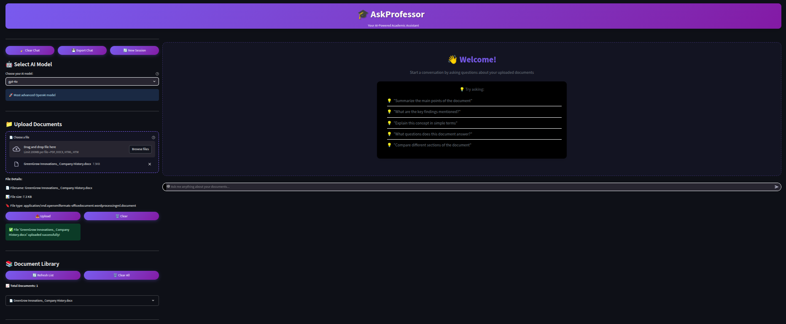
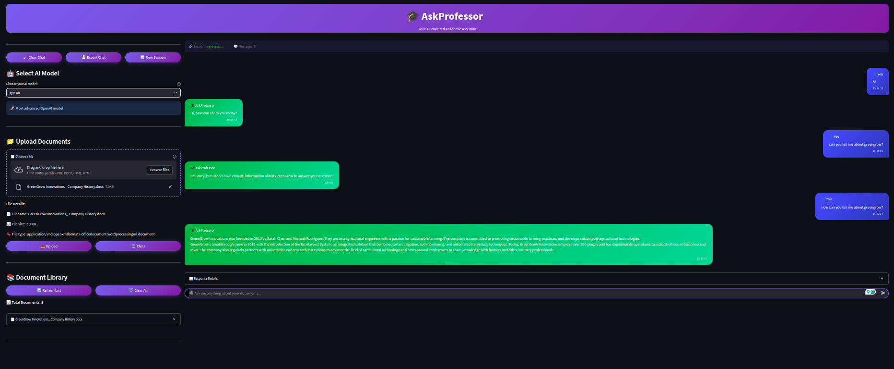

# 🧠 AskProfessor

**AskProfessor** is an AI-powered question-answering application built with **FastAPI**, **LangChain**, and **Streamlit**. It enables users to ask questions and receive intelligent responses, leveraging **Large Language Models (LLMs)** and **Retrieval-Augmented Generation (RAG)** techniques.

---

## 🚀 Features

- ⚡ **FastAPI Backend**: Efficient and scalable API built with FastAPI.
- 🔗 **LangChain Integration**: Utilizes LangChain for advanced LLM interactions.
- 📚 **Retrieval-Augmented Generation (RAG)**: Enhances responses by retrieving relevant context from documents.
- 🧱 **Modular Architecture**: Clean separation of concerns for easy maintenance and scalability.
- 🧠 **LLM Powered**: Uses cutting-edge language models for intelligent answers.
- 🎨 **Streamlit Frontend**: Simple and interactive web UI for end users.

---
## 📸 Preview – AskProfessor Web UI

### 🗂️ Document Upload Interface



Easily upload your private documents through the intuitive interface.

---

### 🧠 AI Response Interface



After uploading a document, AskProfessor uses AI to answer questions based on the uploaded content with context-aware responses.

---

## ⚙️ Setup Instructions

1. **Clone the Repository**

   ```bash
   git clone https://github.com/KMobin555/AskProfessor.git
   cd AskProfessor
   ```

2. **Create a Virtual Environment**

    ```bash
    python -m venv venv
    source venv/bin/activate  # On Windows: venv\Scripts\activate
    ```

3. **Install Dependencies**
    ``` bash
    pip install -r requirements.txt
    ```
4. **Configure Environment Variables**

    Create a .env file in the root directory and add your API keys:

    ```bash 
    GOOGLE_API_KEY=your_google_api_key_here
    ```

    Ensure that .env is listed in your .gitignore to prevent sensitive information from being committed.

5. **Run the Application**

    Start the API backend and the Streamlit frontend in separate terminal tabs or processes:

    Run the FastAPI Backend:
    ```bash
    uvicorn api.main:app --reload
    ```

    Run the Streamlit Frontend:
    ```bash
    streamlit run app/main.py
    ```

    The application will be accessible at http://127.0.0.1:8501.

## 🧪 Usage

- Navigate to [http://127.0.0.1:8000/docs](http://127.0.0.1:8000/docs) to access the interactive **Swagger UI** for the API.
- Visit [http://localhost:8501](http://localhost:8501) to use the **Streamlit UI**.

---

## 🛠️ Technologies Used

- [FastAPI](https://fastapi.tiangolo.com/)
- [LangChain](https://www.langchain.com/)
- [Uvicorn](https://www.uvicorn.org/)
- [Streamlit](https://streamlit.io/)
- Python 3.12

---

## 📄 License

This project is licensed under the **Apache 2.0 License**.

---

## 🙌 Acknowledgments

- Inspired by advancements in **AI-driven question-answering systems**.
- Special thanks to the contributors and the **open-source community**.
